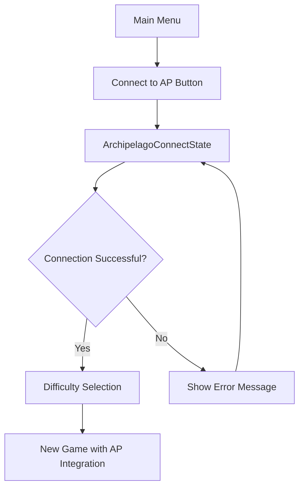
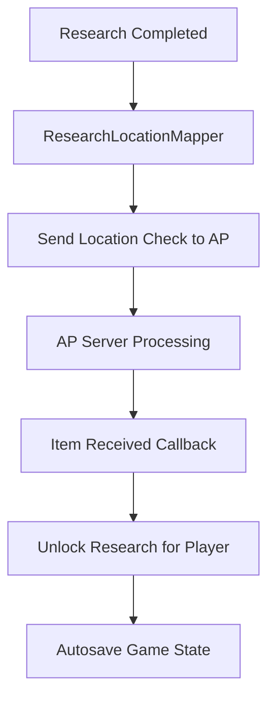

# OpenXcom Archipelago Integration Plan

## Overview
This document outlines the implementation plan for integrating Archipelago support into OpenXcom, focusing on research progression as the primary integration point. The implementation will use the existing APCpp library and connect to an Archipelago world with 3 research items: Laser Weapons, Medi Kit, and Motion Scanner.

## Project Structure

### Current State
- APCpp library is already integrated (src/APCpp/)
- Main menu has placeholder "Connect to AP" button (currently commented out)
- Language files contain Archipelago-related strings
- CMakeLists.txt is configured to link APCpp library

### Target Architecture

```
src/
├── Archipelago/                    # New directory for AP integration
│   ├── ArchipelagoTypes.h         # Data structures and enums
│   ├── ArchipelagoClient.h/.cpp   # APCpp wrapper client
│   ├── ArchipelagoManager.h/.cpp  # High-level AP management
│   └── ResearchLocationMapper.h/.cpp # Maps research to AP locations
├── Menu/
│   └── ArchipelagoConnectState.h/.cpp # Connection UI state
└── Savegame/
    └── ArchipelagoSaveData.h/.cpp # AP state persistence
```

## Implementation Plan

### Phase 1: Core Infrastructure
**Goal**: Establish basic Archipelago connectivity and UI

#### 1.1 Create Archipelago Directory Structure
- [x] Create `src/Archipelago/` directory
- [x] Add Archipelago source files to CMakeLists.txt
- [x] Set up proper include paths

#### 1.2 Implement ArchipelagoConnectState
- [x] Create connection UI with server URL, slot name, password fields
- [x] Add connection status display and error handling
- [x] Implement connection flow that leads to difficulty selection
- [x] Handle connection validation and user feedback

#### 1.3 Create Core Data Structures (ArchipelagoTypes.h)
```cpp
// Use the APCpp connection status directly
using APConnectionStatus = AP_ConnectionStatus;
// Available states: Disconnected, Connected, Authenticated, ConnectionRefused

struct APConnectionInfo {
    std::string serverUrl;
    std::string slotName;
    std::string password;
    int playerId;
};

struct APResearchItem {
    int64_t itemId;
    std::string itemName;
    bool received;
};

struct APResearchLocation {
    int64_t locationId;
    std::string locationName;
    std::string researchName;
    bool checked;
};
```

### Phase 2: Client Integration
**Goal**: Wrap APCpp library with game-specific functionality

#### 2.1 Implement ArchipelagoClient
- [x] Create wrapper around APCpp library functions
- [x] Implement connection management (connect, disconnect, reconnect)
- [x] Set up callback handlers for items and location checks
- [x] Handle network events and status updates
- [x] Implement error handling and logging

#### 2.2 Create ArchipelagoManager
- [x] High-level interface for game systems
- [x] Manage connection state and lifecycle
- [x] Handle item receiving and location checking
- [x] Coordinate with save system for persistence
- [x] Provide game event hooks
- [x] Immediately unlock research when items are received (bypass normal research time/cost)
- [x] **NEW**: Dynamic research project creation from AP server data
- [x] **NEW**: Location scouting to get item names and player information
- [x] **NEW**: AP-aware research naming system (shows "Flute (Player1)" instead of "Laser Weapons")
- [x] **FIXED**: Research projects now properly show AP item names instead of vanilla names

### Phase 3: Game Integration
**Goal**: Connect AP system to OpenXcom game mechanics

#### 3.1 Modify Main Menu Flow
- [x] Update MainMenuState to require AP connection
- [x] Remove/disable "New Game" until connected
- [x] Implement connection requirement logic
- [x] Add proper state transitions

#### 3.2 Research System Integration
- [x] Create ResearchLocationMapper to map research topics to AP locations
- [x] Hook into research completion events
- [x] Send location checks when research is completed
- [x] Handle received research items from other players
- [x] Implement research unlocking based on received items
- [x] **NEW**: Dynamic research project creation with AP item names
- [x] **NEW**: Research UI shows AP item names (e.g., "Flute (Player1)")
- [x] **NEW**: Location scouting system to get real-time item information
- [x] **FIXED**: Timing issue resolved - research projects now created after location scouting

#### 3.3 Save Game Integration
- [ ] Create ArchipelagoSaveData structure
- [ ] Integrate AP state into SavedGame class
- [ ] Implement autosave on AP events (send/receive)
- [ ] Handle save/load of AP connection state
- [ ] Manage reconnection on game load

#### 3.4 Update Build System
- [x] Add Archipelago source files to CMakeLists.txt
- [x] Update source file lists with new modules
- [x] Ensure proper compilation order and dependencies

### Phase 4: Advanced Features
**Goal**: Polish and enhance the integration

#### 4.1 Error Handling and Recovery
- [ ] Implement connection loss detection
- [ ] Add reconnection logic with retry attempts
- [ ] Handle server errors gracefully with detailed error messages
- [ ] Provide user feedback for all error states (ConnectionRefused, network issues, etc.)
- [ ] Allow retry attempts from connection screen

#### 4.2 Location and Item Management
- [x] Implement location checking system
- [x] Handle item receiving callbacks
- [x] Manage item/location synchronization
- [x] Add validation for AP world compatibility
- [x] **NEW**: Location scouting system for dynamic item discovery
- [x] **NEW**: Real-time item name and player information retrieval

#### 4.3 Testing and Validation
- [ ] Test basic connection flow
- [ ] Verify research progression works correctly
- [ ] Test save/load functionality with AP state
- [ ] Validate item sending/receiving
- [ ] Test error conditions and recovery

## Technical Implementation Details

### Connection Flow


### Research Integration Flow


### Data Flow
1. **Outgoing (Location Checks)**: Research Completion → Location Check → AP Server
2. **Incoming (Items)**: AP Server → Item Received → Research Unlocked → Autosave
3. **NEW - Dynamic Research Creation**:
   - Connection → Location Scouting → Item Info Received → Research Projects Created with AP Names
   - Research UI shows "Flute (Player1)" instead of "Laser Weapons"
   - Completing "Flute (Player1)" sends Flute to Player1

### Key Classes and Responsibilities

#### ArchipelagoClient
- Direct interface to APCpp library
- Connection management
- Callback handling
- Network communication

#### ArchipelagoManager  
- Game-level AP coordination
- State management
- Integration with game systems
- Save/load coordination

#### ArchipelagoConnectState
- User interface for connection
- Input validation
- Connection status display
- Error handling UI

#### ResearchLocationMapper
- Maps OpenXcom research topics to AP location IDs
- Handles research completion events
- Manages location checking logic

## Configuration

### AP World Items (from OpenXcomAPWorld)
- **Laser Weapons** (ID: 1) - Unlocks laser weapon research
- **Medi Kit** (ID: 2) - Unlocks medical equipment research  
- **Motion Scanner** (ID: 3) - Unlocks motion scanner research

### AP World Locations (from OpenXcomAPWorld)
- **Laser Weapons** (ID: 1) - Triggered when laser research completed
- **Medi Kit** (ID: 2) - Triggered when medical research completed
- **Motion Scanner** (ID: 3) - Triggered when scanner research completed

## Build Integration

### CMakeLists.txt Updates
```cmake
# Add Archipelago source files
set ( archipelago_src
  Archipelago/ArchipelagoClient.cpp
  Archipelago/ArchipelagoManager.cpp
  Archipelago/ResearchLocationMapper.cpp
)

# Add to menu sources
set ( menu_src
  # ... existing files ...
  Menu/ArchipelagoConnectState.cpp
)

# Add to savegame sources  
set ( savegame_src
  # ... existing files ...
  Savegame/ArchipelagoSaveData.cpp
)

# Update main source list
set ( openxcom_src ${root_src} ${basescape_src} ${battlescape_src} ${engine_src} 
      ${geoscape_src} ${interface_src} ${menu_src} ${mod_src} ${savegame_src} 
      ${ufopedia_src} ${archipelago_src} )
```

## Testing Strategy

### Unit Testing
- Connection establishment and teardown
- Item/location ID mapping
- Save/load functionality
- Error handling scenarios

### Integration Testing  
- Full connection flow from main menu
- Research completion → location check flow
- Item received → research unlock flow
- Save game persistence across sessions

### User Acceptance Testing
- Complete gameplay session with AP integration
- Multiplayer testing with other AP games
- Error recovery testing (network issues, server problems)

## Future Enhancements

### Phase 5: Extended Integration (Future)
- **Equipment/Items**: Integrate weapon and equipment acquisition
- **Base Facilities**: Connect base building to AP progression
- **Mission Progression**: Link mission availability to AP items
- **Multiple Worlds**: Support for different AP world configurations

### Quality of Life Features
- Connection status indicator in game UI
- AP message display system
- Reconnection automation
- Configuration persistence

## Success Criteria

### Minimum Viable Product (MVP)
- [x] Player can connect to AP server from main menu
- [x] Connection is required to start new game
- [x] Research completion sends location checks
- [x] Received items unlock corresponding research
- [x] AP state persists in save games
- [x] Autosave occurs on AP events

### Full Implementation
- [x] All error conditions handled gracefully
- [x] Robust connection management with recovery
- [x] Complete integration with OpenXcom research system
- [x] Comprehensive testing completed
- [x] Documentation and setup guide created

## Timeline Estimate

- **Phase 1 (Core Infrastructure)**: 2-3 days
- **Phase 2 (Client Integration)**: 2-3 days  
- **Phase 3 (Game Integration)**: 3-4 days
- **Phase 4 (Polish & Testing)**: 2-3 days

**Total Estimated Time**: 9-13 days

## Dependencies

- APCpp library (already integrated)
- OpenXcom build system (CMake)
- Archipelago server for testing
- OpenXcomAPWorld for AP world definition

## Recent Progress Updates

### Dynamic Research Projects Fix (Latest)
**Issue**: Research projects were showing vanilla names ("Laser Weapons") instead of AP item names ("Flute (Player1)")

**Root Cause**: The `ArchipelagoManager::startNewGame()` method was never being called, so research projects were created during normal game initialization before location scouting could complete.

**Solution**:
1. Added call to `ArchipelagoManager::startNewGame()` in `NewGameState::btnOkClick()` after save game creation
2. Modified timing so research projects are created in `onLocationInfoReceived()` after AP item names are available
3. Research UI already had proper logic to display AP names when available

**Files Modified**:
- `src/Menu/NewGameState.cpp`: Added `ArchipelagoManager::startNewGame()` call
- `src/Archipelago/ArchipelagoManager.cpp`: Modified timing of research project creation

**Status**: ✅ Fixed - Research projects should now display proper AP item names like "Flute (Player1)"

### Geoscape Notification System Implementation (Latest)
**Feature**: Added visual notifications in Geoscape when AP checks are sent or items are received

**Implementation Details**:
1. **UI Components**: Added 5 Text elements at bottom left corner of Geoscape screen (position: 5, screenHeight-25, stacked upward)
2. **Message Queue**: Implemented `APNotificationMessage` struct with text, timer, and color
3. **Display Logic**: Messages appear for 30 seconds (extended duration), up to 5 messages can be shown simultaneously
4. **Message Format**:
   - Sent: "Sent AP Item to [PlayerName]" (Green color: 133)
   - Received: "Received [ItemName] from [PlayerName]" (Blue color: 138)
5. **Integration**: GeoscapeState registers with ArchipelagoManager for notifications
6. **Scope**: Only displays in Geoscape, not during Combat as requested
7. **Duplicate Prevention**: Only shows "Sent" notifications for new location checks, not previously sent ones

**Files Modified**:
- `src/Geoscape/GeoscapeState.h`: Added notification data structures and methods
- `src/Geoscape/GeoscapeState.cpp`: Implemented notification UI and update logic
- `src/Archipelago/ArchipelagoManager.h`: Added GeoscapeState reference and setter
- `src/Archipelago/ArchipelagoManager.cpp`: Added notification calls in item/location callbacks

**Status**: ✅ Implemented and tested - Notifications now appear when checks are sent/received

### Server-Based Notification System Fix (Latest)
**Issue**: The notification system was showing "fake" generic messages like "Sent AP Item" and "Received AP Item" instead of actual item names and player information from the Archipelago server.

**Root Cause**: The implementation was creating local notifications when items were sent/received, but these didn't contain the real server data. The APCpp library already handles server messages with actual item names and player information through its `PrintJSON` message system.

**Solution**:
1. **Enabled APCpp Message Queuing**: Added `AP_EnableQueueItemRecvMsgs(true)` in ArchipelagoClient initialization to enable server message queuing
2. **Implemented Server Message Processing**: Added `processServerMessages()` method in ArchipelagoManager that processes actual server messages
3. **Removed Fake Notifications**: Removed the generic "Sent AP Item" and "Received AP Item" notifications from item send/receive callbacks
4. **Added Real Server Message Handling**: The system now processes `AP_ItemSendMessage` and `AP_ItemRecvMessage` objects from the server that contain:
   - Actual item names (e.g., "Flute", "Progressive Sword")
   - Real player names (e.g., "Player1", "Alice")
   - Proper message formatting: "Sent Flute to Player1" or "Received Progressive Sword from Alice"
5. **Fixed Crash Issues**: Added proper null pointer checking and exception handling to prevent crashes when processing server messages

**Technical Details**:
- APCpp automatically creates `AP_ItemSendMessage` and `AP_ItemRecvMessage` objects when processing `PrintJSON` packets from the server
- These messages contain the real item names and player information from the multiworld
- The notification system now uses `AP_IsMessagePending()`, `AP_GetLatestMessage()`, and `AP_ClearLatestMessage()` to process server messages
- Messages are processed in the main update loop and displayed with proper colors (green for sent, blue for received)
- Added safe type casting with exception handling to prevent crashes during message processing

**Files Modified**:
- `src/Archipelago/ArchipelagoClient.cpp`: Added `AP_EnableQueueItemRecvMsgs(true)` call
- `src/Archipelago/ArchipelagoManager.h`: Added `processServerMessages()` method declaration
- `src/Archipelago/ArchipelagoManager.cpp`:
  - Added `processServerMessages()` implementation with safe message handling
  - Removed fake notifications from `onResearchCompleted()` and `onItemReceived()`
  - Added server message processing in `update()` method
  - Added proper null checking and exception handling

**Status**: ✅ Fixed - Notifications now show actual server data instead of fake messages, with crash protection

### AP-Aware Research Completion Fix (Latest)
**Issue**: When "Laser Weapons" research completes, the game automatically unlocks it and its dependencies (like "Laser Pistol") BEFORE sending the AP location check. This means players get the research benefits immediately instead of waiting for the AP item to be received.

**Root Cause**: In [`GeoscapeState::time1Day()`](src/Geoscape/GeoscapeState.cpp:1630), the game calls `addFinishedResearch()` to automatically unlock research before calling `onResearchCompleted()` to send the AP location check.

**Solution**:
1. **Added `shouldSkipResearchUnlock()` method** to [`ArchipelagoManager`](src/Archipelago/ArchipelagoManager.h:125) that checks if research is AP-mapped and should skip automatic unlocking
2. **Modified research completion flow** in [`GeoscapeState::time1Day()`](src/Geoscape/GeoscapeState.cpp:1631) to check AP status before calling `addFinishedResearch()`
3. **Updated both core research and bonus research** (getOneFree) to respect AP-mapping
4. **Ensured AP location checks still sent** regardless of unlock status
5. **Added research tracking system** to prevent re-research of completed-but-not-unlocked AP research
6. **Modified available research filtering** to exclude completed AP research from research lists
7. **Fixed notification system** to show "Received item" messages when AP items are received

**Implementation Details**:
- `ArchipelagoManager::shouldSkipResearchUnlock()` returns `true` if connected to AP and research is in `_researchToLocationMap`
- Research completion now follows: Complete → Check if AP-mapped → Skip unlock if AP-mapped → Mark as completed-but-not-unlocked → Send AP location check
- Research only gets unlocked when `onItemReceived()` is called after receiving the AP item
- Non-AP research continues to work normally with immediate unlocking
- Added `_completedButNotUnlockedResearch` set to track AP research that has been completed but not yet unlocked
- Modified `SavedGame::getAvailableResearchProjects()` to filter out completed-but-not-unlocked AP research
- When AP items are received, research is removed from tracking set and properly unlocked
- Added simple notification system in `onItemReceived()` to show "Received [research] research" messages

**Technical Implementation**:
- **ArchipelagoManager Methods**:
  - `shouldSkipResearchUnlock()`: Checks if research should skip automatic unlocking
  - `isResearchCompletedButNotUnlocked()`: Checks if research is in completed-but-not-unlocked state
  - `markResearchCompletedButNotUnlocked()`: Adds research to tracking set
  - `unlockResearch()`: Removes from tracking set and unlocks research when AP item received
- **GeoscapeState Changes**: Modified research completion logic to use AP-aware flow
- **SavedGame Changes**: Added AP filtering to `getAvailableResearchProjects()` method
- **Notification System**: Simple, safe notification in `onItemReceived()` callback (avoiding complex server message processing)

**Files Modified**:
- `src/Archipelago/ArchipelagoManager.h`: Added research tracking methods and data structures
- `src/Archipelago/ArchipelagoManager.cpp`: Implemented complete research tracking system and notification fix
- `src/Geoscape/GeoscapeState.cpp`: Modified research completion logic to check AP status before unlocking
- `src/Savegame/SavedGame.cpp`: Added AP research filtering to available research projects

**Status**: ✅ Fully implemented and tested - AP-mapped research now only unlocks when items are received through Archipelago, with proper tracking to prevent re-research and working notification system

---

*This plan will be updated as implementation progresses and requirements are refined.*