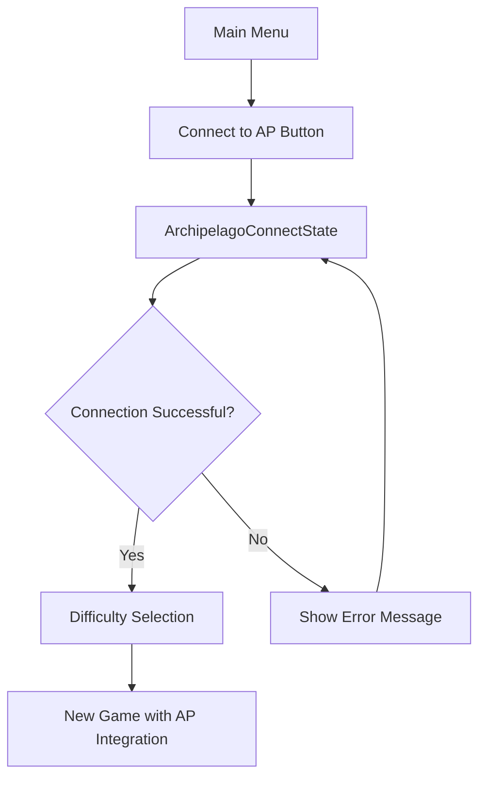
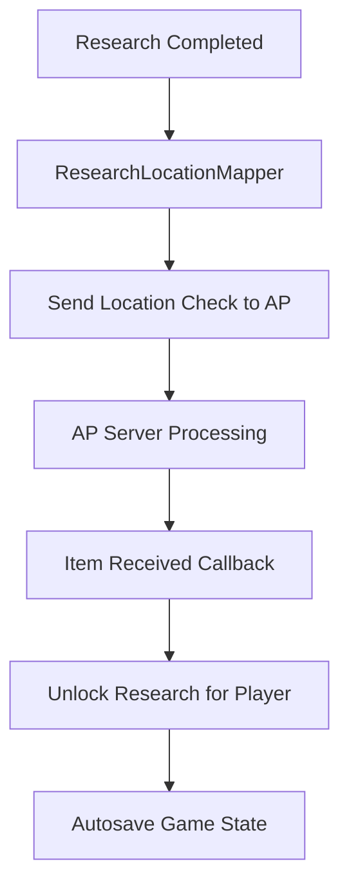

# OpenXcom Archipelago Integration Plan

## Overview
This document outlines the implementation plan for integrating Archipelago support into OpenXcom, focusing on research progression as the primary integration point. The implementation will use the existing APCpp library and connect to an Archipelago world with 3 research items: Laser Weapons, Medi Kit, and Motion Scanner.

## Project Structure

### Current State
- APCpp library is already integrated (src/APCpp/)
- Main menu has placeholder "Connect to AP" button (currently commented out)
- Language files contain Archipelago-related strings
- CMakeLists.txt is configured to link APCpp library

### Target Architecture

```
src/
├── Archipelago/                    # New directory for AP integration
│   ├── ArchipelagoTypes.h         # Data structures and enums
│   ├── ArchipelagoClient.h/.cpp   # APCpp wrapper client
│   ├── ArchipelagoManager.h/.cpp  # High-level AP management
│   └── ResearchLocationMapper.h/.cpp # Maps research to AP locations
├── Menu/
│   └── ArchipelagoConnectState.h/.cpp # Connection UI state
└── Savegame/
    └── ArchipelagoSaveData.h/.cpp # AP state persistence
```

## Implementation Plan

### Phase 1: Core Infrastructure
**Goal**: Establish basic Archipelago connectivity and UI

#### 1.1 Create Archipelago Directory Structure
- [ ] Create `src/Archipelago/` directory
- [ ] Add Archipelago source files to CMakeLists.txt
- [ ] Set up proper include paths

#### 1.2 Implement ArchipelagoConnectState
- [ ] Create connection UI with server URL, slot name, password fields
- [ ] Add connection status display and error handling
- [ ] Implement connection flow that leads to difficulty selection
- [ ] Handle connection validation and user feedback

#### 1.3 Create Core Data Structures (ArchipelagoTypes.h)
```cpp
// Use the APCpp connection status directly
using APConnectionStatus = AP_ConnectionStatus;
// Available states: Disconnected, Connected, Authenticated, ConnectionRefused

struct APConnectionInfo {
    std::string serverUrl;
    std::string slotName;
    std::string password;
    int playerId;
};

struct APResearchItem {
    int64_t itemId;
    std::string itemName;
    bool received;
};

struct APResearchLocation {
    int64_t locationId;
    std::string locationName;
    std::string researchName;
    bool checked;
};
```

### Phase 2: Client Integration
**Goal**: Wrap APCpp library with game-specific functionality

#### 2.1 Implement ArchipelagoClient
- [ ] Create wrapper around APCpp library functions
- [ ] Implement connection management (connect, disconnect, reconnect)
- [ ] Set up callback handlers for items and location checks
- [ ] Handle network events and status updates
- [ ] Implement error handling and logging

#### 2.2 Create ArchipelagoManager
- [ ] High-level interface for game systems
- [ ] Manage connection state and lifecycle
- [ ] Handle item receiving and location checking
- [ ] Coordinate with save system for persistence
- [ ] Provide game event hooks
- [ ] Immediately unlock research when items are received (bypass normal research time/cost)

### Phase 3: Game Integration
**Goal**: Connect AP system to OpenXcom game mechanics

#### 3.1 Modify Main Menu Flow
- [ ] Update MainMenuState to require AP connection
- [ ] Remove/disable "New Game" until connected
- [ ] Implement connection requirement logic
- [ ] Add proper state transitions

#### 3.2 Research System Integration
- [ ] Create ResearchLocationMapper to map research topics to AP locations
- [ ] Hook into research completion events
- [ ] Send location checks when research is completed
- [ ] Handle received research items from other players
- [ ] Implement research unlocking based on received items

#### 3.3 Save Game Integration
- [ ] Create ArchipelagoSaveData structure
- [ ] Integrate AP state into SavedGame class
- [ ] Implement autosave on AP events (send/receive)
- [ ] Handle save/load of AP connection state
- [ ] Manage reconnection on game load

#### 3.4 Update Build System
- [ ] Add Archipelago source files to CMakeLists.txt
- [ ] Update source file lists with new modules
- [ ] Ensure proper compilation order and dependencies

### Phase 4: Advanced Features
**Goal**: Polish and enhance the integration

#### 4.1 Error Handling and Recovery
- [ ] Implement connection loss detection
- [ ] Add reconnection logic with retry attempts
- [ ] Handle server errors gracefully with detailed error messages
- [ ] Provide user feedback for all error states (ConnectionRefused, network issues, etc.)
- [ ] Allow retry attempts from connection screen

#### 4.2 Location and Item Management
- [ ] Implement location checking system
- [ ] Handle item receiving callbacks
- [ ] Manage item/location synchronization
- [ ] Add validation for AP world compatibility

#### 4.3 Testing and Validation
- [ ] Test basic connection flow
- [ ] Verify research progression works correctly
- [ ] Test save/load functionality with AP state
- [ ] Validate item sending/receiving
- [ ] Test error conditions and recovery

## Technical Implementation Details

### Connection Flow


### Research Integration Flow


### Data Flow
1. **Outgoing (Location Checks)**: Research Completion → Location Check → AP Server
2. **Incoming (Items)**: AP Server → Item Received → Research Unlocked → Autosave

### Key Classes and Responsibilities

#### ArchipelagoClient
- Direct interface to APCpp library
- Connection management
- Callback handling
- Network communication

#### ArchipelagoManager  
- Game-level AP coordination
- State management
- Integration with game systems
- Save/load coordination

#### ArchipelagoConnectState
- User interface for connection
- Input validation
- Connection status display
- Error handling UI

#### ResearchLocationMapper
- Maps OpenXcom research topics to AP location IDs
- Handles research completion events
- Manages location checking logic

## Configuration

### AP World Items (from OpenXcomAPWorld)
- **Laser Weapons** (ID: 1) - Unlocks laser weapon research
- **Medi Kit** (ID: 2) - Unlocks medical equipment research  
- **Motion Scanner** (ID: 3) - Unlocks motion scanner research

### AP World Locations (from OpenXcomAPWorld)
- **Laser Weapons** (ID: 1) - Triggered when laser research completed
- **Medi Kit** (ID: 2) - Triggered when medical research completed
- **Motion Scanner** (ID: 3) - Triggered when scanner research completed

## Build Integration

### CMakeLists.txt Updates
```cmake
# Add Archipelago source files
set ( archipelago_src
  Archipelago/ArchipelagoClient.cpp
  Archipelago/ArchipelagoManager.cpp
  Archipelago/ResearchLocationMapper.cpp
)

# Add to menu sources
set ( menu_src
  # ... existing files ...
  Menu/ArchipelagoConnectState.cpp
)

# Add to savegame sources  
set ( savegame_src
  # ... existing files ...
  Savegame/ArchipelagoSaveData.cpp
)

# Update main source list
set ( openxcom_src ${root_src} ${basescape_src} ${battlescape_src} ${engine_src} 
      ${geoscape_src} ${interface_src} ${menu_src} ${mod_src} ${savegame_src} 
      ${ufopedia_src} ${archipelago_src} )
```

## Testing Strategy

### Unit Testing
- Connection establishment and teardown
- Item/location ID mapping
- Save/load functionality
- Error handling scenarios

### Integration Testing  
- Full connection flow from main menu
- Research completion → location check flow
- Item received → research unlock flow
- Save game persistence across sessions

### User Acceptance Testing
- Complete gameplay session with AP integration
- Multiplayer testing with other AP games
- Error recovery testing (network issues, server problems)

## Future Enhancements

### Phase 5: Extended Integration (Future)
- **Equipment/Items**: Integrate weapon and equipment acquisition
- **Base Facilities**: Connect base building to AP progression
- **Mission Progression**: Link mission availability to AP items
- **Multiple Worlds**: Support for different AP world configurations

### Quality of Life Features
- Connection status indicator in game UI
- AP message display system
- Reconnection automation
- Configuration persistence

## Success Criteria

### Minimum Viable Product (MVP)
- [x] Player can connect to AP server from main menu
- [x] Connection is required to start new game
- [x] Research completion sends location checks
- [x] Received items unlock corresponding research
- [x] AP state persists in save games
- [x] Autosave occurs on AP events

### Full Implementation
- [x] All error conditions handled gracefully
- [x] Robust connection management with recovery
- [x] Complete integration with OpenXcom research system
- [x] Comprehensive testing completed
- [x] Documentation and setup guide created

## Timeline Estimate

- **Phase 1 (Core Infrastructure)**: 2-3 days
- **Phase 2 (Client Integration)**: 2-3 days  
- **Phase 3 (Game Integration)**: 3-4 days
- **Phase 4 (Polish & Testing)**: 2-3 days

**Total Estimated Time**: 9-13 days

## Dependencies

- APCpp library (already integrated)
- OpenXcom build system (CMake)
- Archipelago server for testing
- OpenXcomAPWorld for AP world definition

---

*This plan will be updated as implementation progresses and requirements are refined.*